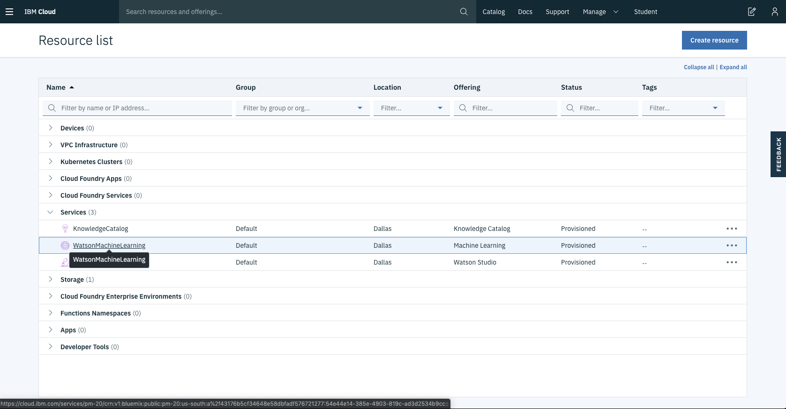
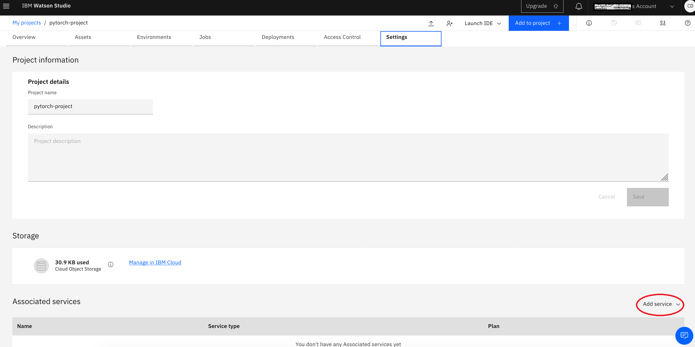
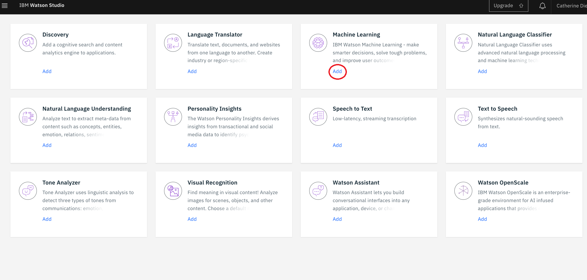
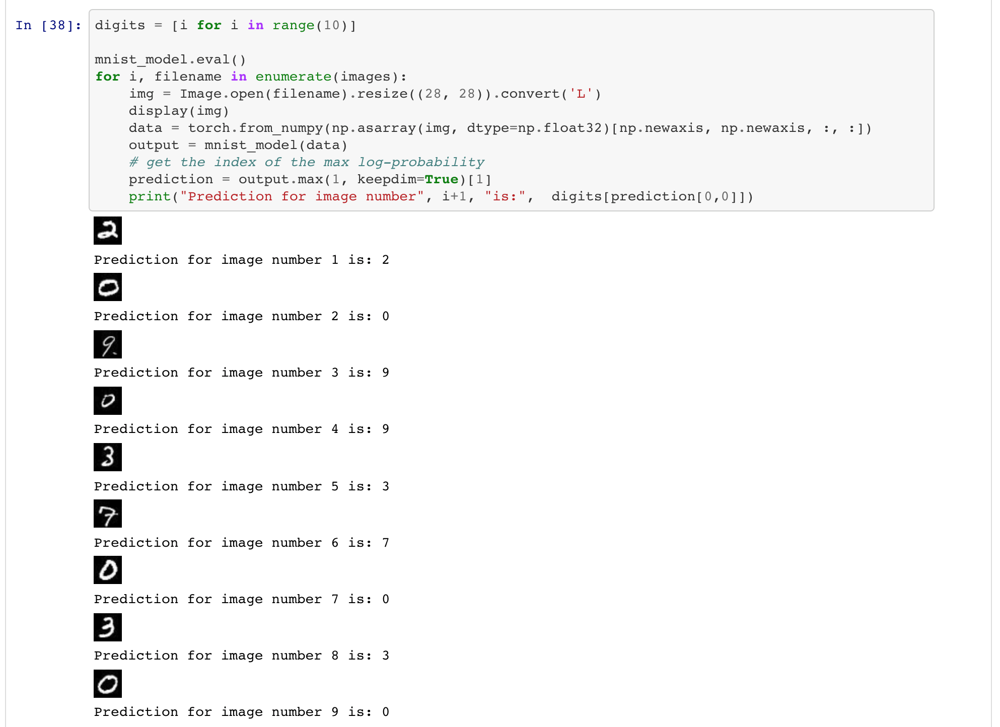

# WARNING: This repository is no longer maintained

> This repository will not be updated. The repository will be kept available in read-only mode.

# Use Watson Studio and PyTorch to create a machine learning model to recognize handwritten digits

## Overview

Recognizing handwritten numbers is a piece of cake for humans, but it's a non-trivial task for machines. Nowadays, with the advancement of machine learning, people have made machines more and more capable of performing this task. We now have mobile banking apps that can scan checks in seconds and accounting software that can extract dollar amounts from thousands of contracts in minutes. If you are interested in knowing how this all works, please follow along with this code pattern as we take you through the steps to create a simple handwritten digit recognizer in Watson Studio with PyTorch.

## What is Watson Studio?

[Watson Studio](https://dataplatform.cloud.ibm.com/) is an integrated environment for data scientists, developers and domain experts to collaboratively work with data to build, train and deploy models at scale. If you are new to Watson Studio, the best way to understand it is to [see it in action](https://medium.com/ibm-watson/ibm-watson-studio-in-10-videos-6acf96cc608a)

## What is PyTorch?

[PyTorch](https://pytorch.org/) is a relatively new deep learning framework. Yet, it has begun to gain adoption especially among researchers and data scientists. The strength of PyTorch is its support of dynamic computational graph while most deep learning frameworks are based on static computational graph. In addition, its strong NumPy like GPU accelerated tensor computation has allowed Python developers to easily learn and build deep learning networks for GPUs and CPUs alike.

In this code pattern, you will use Jupyter Notebook in Watson Studio and access preinstalled and optimized PyTorch environments through the Python client library of the [Watson Machine Learning](https://cloud.ibm.com/catalog/services/machine-learning) service, which has a set of REST APIs in its core that allows users to submit training jobs, monitor status, and store and deploy models.

When you have completed this code pattern, you will understand how to:

* Create a project in Watson Studio and use Jupyter Notebooks in the project.
* Use the Python client of Cloud Object Storage to create buckets and upload data to buckets.
* Submit PyTorch training jobs to Watson Machine Learning service.
* Use the trained PyTorch model to predict handwritten digits from images.

## Flow


1. Log into IBM Watson Studio
2. Run the Jupyter notebook in Watson Studio
3. Use PyTorch to download and process the data
4. Use Watson Machine Learning to train and deploy the model

## Included components

* [Watson Machine Learning](https://cloud.ibm.com/catalog/services/machine-learning): Make smarter decisions, solve tough problems, and improve user outcomes.
* [Watson Studio](https://developer.ibm.com/components/watson-studio-c/): IBM's integrated hybrid environment that provides flexible data science tools to build and train AI models and prepare and analyze data.
* [Jupyter Notebooks](https://jupyter.org/): An open-source web application that allows you to create and share documents that contain live code, equations, visualizations and explanatory text.
* [Cloud Object Storage](https://cloud.ibm.com/catalog/services/cloud-object-storage): Provides flexible, cost-effective, and scalable cloud storage for unstructured data.

## Featured technologies

* [Artificial Intelligence](https://medium.com/ibm-data-science-experience): Artificial intelligence can be applied to disparate solution spaces to deliver disruptive technologies.
* [Python](https://www.python.org/): Python is a programming language that lets you work more quickly and integrate your systems more effectively.
* [PyTorch](https://pytorch.org/): PyTorch is an open source deep learning platform that provides a seamless path from research prototyping to production deployment.

<!--
# Watch the Video

!! COMING !!
 -->

## Steps

1. [Sign up for Watson Studio](#1-sign-up-for-watson-studio)
1. [Create a new project](#2-create-a-new-project)
1. [Create the notebook](#3-create-the-notebook)
1. [Create a Watson Machine Learning Service instance](#4-create-a-watson-machine-learning-service-instance)
1. [Create HMAC credentials for the Cloud Object Storage instance](#5-create-hmac-credentials-for-the-cloud-object-storage-instance)
1. [Run the notebook](#6-run-the-notebook)
1. [See the results](#7-see-the-results)

### 1. Sign up for Watson Studio

Sign up for IBM's [Watson Studio](https://dataplatform.cloud.ibm.com/). By creating a project in Watson Studio a free tier Object Storage service will be created in your IBM Cloud account. Take note of your service names as you will need to select them in the following steps.

Note: When creating your Object Storage service, select the `Free storage` type in order to avoid having to pay an upgrade fee.

### 2. Create a new project

From the Watson Studio home page, click on the `Navigation Menu` `☰` icon on the top left, expand the `Project` option, then click on the `View all projects`tab.  Once you land in the [My projects](https://dataplatform.cloud.ibm.com/projects) page, click on the "New project" button  and then select the `Create an empty project` option.


* To create a project in Watson Studio, give the project a name and select an existing Cloud Object Storage from your IBM Cloud account.


* Upon a successful project creation, you are taken to a dashboard view of your project. Take note of the `Assets` and `Settings` tabs, we'll be using them to associate our project with any external assets (such as notebooks) and any IBM Cloud services.


### 3. Create the notebook

From the project dashboard view, select the `Add to project` tab and click on the `Notebook` button.


Use the `From URL` tab to create our notebook.

* Give your notebook a name and select your desired runtime. In this case, select the `Default Python 3.6 Free` option.

* For URL, enter the following URL for the notebook stored in our GitHub repository:

  ```bash
  https://raw.githubusercontent.com/IBM/pytorch-on-watson-studio/master/notebooks/use-pytorch-to-predict-handwritten-digits.ipynb
  ```


* Press the `Create Notebook` button.

### 4. Create or access the Watson Machine Learning Service instance

If you have existing running instance of Watson Machine Learning (WML) Service, you can go to the [IBM Cloud Resources](https://cloud.ibm.com/resources) page and click on the desired WML service to access the service details.



If you do not already have a running instance of the WML service, follow these steps to create one.

* From the IBM Cloud Catalog, under the AI category, select [Machine Learning](https://cloud.ibm.com/catalog/services/machine-learning).
* Select the `Lite` plan, enter a service name located at the bottom of the page, then press `Create`.


Once the service instance is created or you have landed in the service instance page of your choice, navigate to `Service credentials`, view credentials and make note of them. If you don't see any credentials available, create a `New credential`.

  <!-- PLEASE! Make this workaround go away. Delete it when fixed. -->
  > If you get this error: *"You do not have the required permission to assign role 'Writer'. Contact the account owner to update your access."* Give yourself writer access by:

* Use the IBM Cloud menu `☰` and select `Security`.
* Click on `Manage`.
* Click on `Identity and Access`.
* Use the three dots icon to assign access to yourself.
* Click on `Assign access to resources`.
* Use the `Services` pulldown to select `All Identity and Access enabled services`.
* Use the checkbox to enable `Writer`.
* Hit `Assign`.
* Go back and try to create your Watson ML credentials again.


* In the notebook available with this pattern, there is a cell which requires you to enter your WML credentials. Copy and paste these credentials into that notebook cell.


Execute the following steps to associate a WML service to your project:

* Go to the [My projects](https://dataplatform.cloud.ibm.com/projects) page, click on your project.
* Click on the `Settings` tab
* Click on the `Add service` button located in the `Associated services` section and then select `Watson`
  .
* Click the `Add` button located in the `Machine Learning` tile.
  .
* Select a WML service from the drop-down menu to associate it with your project.

### 5. Create HMAC credentials for the Cloud Object Storage instance

To run the notebook available with this pattern, you must create a `Keyed-Hashing for Message Authentication` (HMAC) set of credentials for your Cloud Object Storage instance.

* From the [IBM Cloud Resources](https://cloud.ibm.com/resources) page, click on the Cloud Object Storage instance that you assigned to your Watson Studio project. Then click the `Service credentials` tab.


* Click on `New Credential` to initiate creating a new set of credentials. Enter a name, then expand `Advanced options` to  turn on the `Include HMAC Credential` option. Press `Add` to create the credentials.


* Once the credentials are created, you should see a set of `cos_hmac_keys` values.


* In the notebook available with this pattern, there is a cell which requires you to enter your Cloud Object Storage credentials. Copy and paste these credentials into that notebook cell.


### 6. Run the notebook

To view your notebooks, select `Notebooks` in the project `Assets` list. To run a notebook, simply click on the `edit` icon listed in the row associated with the notebook in the `Notebooks` list.


Some background on executing notebooks:

> When a notebook is executed, what is actually happening is that each code cell in
the notebook is executed, in order, from top to bottom.
>
> Each code cell is selectable and is preceded by a tag in the left margin. The tag
format is `In [x]:`. Depending on the state of the notebook, the `x` can be:
>
>* A blank, this indicates that the cell has never been executed.
>* A number, this number represents the relative order this code step was executed.
>* A `*`, which indicates that the cell is currently executing.
>
>There are several ways to execute the code cells in your notebook:
>
>* One cell at a time.
>   * Select the cell, and then press the `Play` button in the toolbar.
>* Batch mode, in sequential order.
>   * From the `Cell` menu bar, there are several options available. For example, you
    can `Run All` cells in your notebook, or you can `Run All Below`, that will
    start executing from the first cell under the currently selected cell, and then
    continue executing all cells that follow.
>* At a scheduled time.
>   * Press the `Schedule` button located in the top right section of your notebook
    panel. Here you can schedule your notebook to be executed once at some future
    time, or repeatedly at your specified interval.

### 7. See the results

Once the model is trained we can use it to recognize handwritten digits.

> Note: With only 1 epoch, the results might be less then perfect.



## Sample output

View a copy of the notebook including output [here](data/examples/use-pytorch-to-predict-handwritten-digits.ipynb).

## Links

* [Create Watson Studio Notebooks](https://dataplatform.cloud.ibm.com/docs/content/analyze-data/creating-notebooks.html)

## Learn more

* **Data Analytics Code Patterns**: Enjoyed this Code Pattern? Check out our other [Data Analytics Code Patterns](https://developer.ibm.com/technologies/data-science/)
* **AI and Data Code Pattern Playlist**: Bookmark our [playlist](https://www.youtube.com/playlist?list=PLzUbsvIyrNfknNewObx5N7uGZ5FKH0Fde) with all of our Code Pattern videos
* **Watson Studio**: Master the art of data science with IBM's [Watson Studio](https://www.ibm.com/cloud/watson-studio)
* **Spark on IBM Cloud**: Need a Spark cluster? Create up to 30 Spark executors on IBM Cloud with our [Spark service](https://cloud.ibm.com/catalog/services/apache-spark)

## License

This code pattern is licensed under the Apache Software License, Version 2.  Separate third party code objects invoked within this code pattern are licensed by their respective providers pursuant to their own separate licenses. Contributions are subject to the [Developer Certificate of Origin, Version 1.1 (DCO)](https://developercertificate.org/) and the [Apache Software License, Version 2](https://www.apache.org/licenses/LICENSE-2.0.txt).

[Apache Software License (ASL) FAQ](https://www.apache.org/foundation/license-faq.html#WhatDoesItMEAN)
